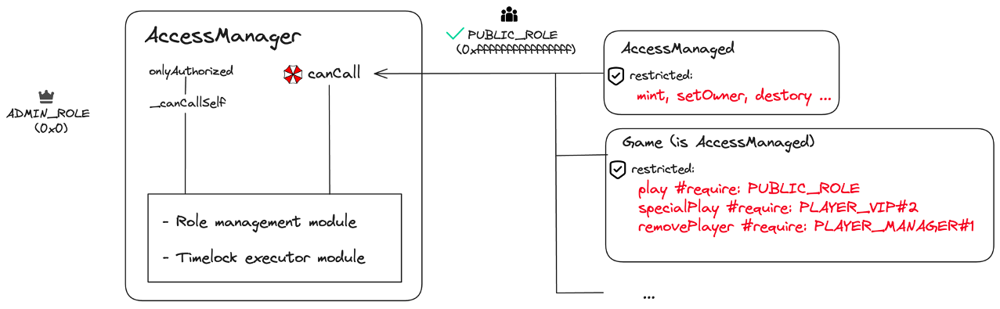

# Manager

<!--  -->

import AccessManagerOverview from "./statics/AccessManagerOverview.svg";

<AccessManagerOverview className="h-svg" />

The `AccessManager` contract serves as a pivotal gatekeeper. All contracts inheriting from the `AccessManaged` contract can specify an `AccessManager` and use the `restricted` modifier to enforce access control on certain functions.

The `restricted` modifier query the state of the `AccessManager` contract to determine whether the caller has the necessary privileges to execute the function it protects.

## AuthorityUtils.sol

:::info
code: [`openzeppelin-contracts/contracts/access/manager/AuthorityUtils.sol`](https://github.com/OpenZeppelin/openzeppelin-contracts/blob/v5.0.1/contracts/access/manager/AuthorityUtils.sol)
:::

- **function canCallWithDelay**: authority.canCall(caller, target, selector) -> (immediate, dealy)

```solidity
/**
* @dev Since `AccessManager` implements an extended IAuthority interface, invoking `canCall` with backwards compatibility
* for the preexisting `IAuthority` interface requires special care to avoid reverting on insufficient return data.
* This helper function takes care of invoking `canCall` in a backwards compatible way without reverting.
*/
function canCallWithDelay(
    address authority,
    address caller,
    address target,
    bytes4 selector
) internal view returns (bool immediate, uint32 delay) {
    (bool success, bytes memory data) = authority.staticcall(
        abi.encodeCall(IAuthority.canCall, (caller, target, selector))
    );
    if (success) {
        if (data.length >= 0x40) {
            (immediate, delay) = abi.decode(data, (bool, uint32));
        } else if (data.length >= 0x20) {
            immediate = abi.decode(data, (bool));
        }
    }
    return (immediate, delay);
}
```

## AccessManaged.sol

:::info
code: [`openzeppelin-contracts/contracts/access/manager/AccessManaged.sol`](https://github.com/OpenZeppelin/openzeppelin-contracts/blob/v5.0.1/contracts/access/manager/AccessManaged.sol)
:::

1. Provide the `restricted` modifier

2. Allow `AccessManager` contract invoke the `setAuthority` function to update current `_authority`.

- **modifier restricted:**

```solidity
modifier restricted() {
    _checkCanCall(_msgSender(), _msgData());
    _;
}
```

```solidity showLineNumbers
function _checkCanCall(address caller, bytes calldata data) internal virtual {
    (bool immediate, uint32 delay) = AuthorityUtils.canCallWithDelay(
        authority(),
        caller,
        address(this),
        bytes4(data[0:4])
    );
    if (!immediate) {
        if (delay > 0) {
            _consumingSchedule = true;
            IAccessManager(authority()).consumeScheduledOp(caller, data);
            _consumingSchedule = false;
        } else {
            revert AccessManagedUnauthorized(caller);
        }
    }
}
```

Possible scenarios for a caller to invoke a restricted function:

1. `immediate = false AND dealy = 0`: Unauthorized caller.
2. `immediate = false && delay > 0`: Privileged caller but need time delay
3. `immediate = true`: Privileged caller can execute the function immediately


Q-1: Why can not be used by internal functions?
```text
* [IMPORTANT]
* ====
* In general, this modifier should only be used on `external` functions. It is okay to use it on `public`
* functions that are used as external entry points and are not called internally. Unless you know what you're
* doing, it should never be used on `internal` functions. Failure to follow these rules can have critical security
* implications! This is because the permissions are determined by the function that entered the contract, i.e. the
* function at the bottom of the call stack, and not the function where the modifier is visible in the source code.
* ====
```

Q-2: Why can not be used by receive function?

```text
* [WARNING]
* ====
* Avoid adding this modifier to the https://docs.soliditylang.org/en/v0.8.20/contracts.html#receive-ether-function[`receive()`]
* function or the https://docs.soliditylang.org/en/v0.8.20/contracts.html#fallback-function[`fallback()`]. These
* functions are the only execution paths where a function selector cannot be unambiguosly determined from the calldata
* since the selector defaults to `0x00000000` in the `receive()` function and similarly in the `fallback()` function
* if no calldata is provided. (See {_checkCanCall}).
*
* The `receive()` function will always panic whereas the `fallback()` may panic depending on the calldata length.
* ====
```

- **function setAuthority:**

```solidity
/// @inheritdoc IAccessManaged
function setAuthority(address newAuthority) public virtual {
    address caller = _msgSender();
    if (caller != authority()) {
        revert AccessManagedUnauthorized(caller);
    }
    if (newAuthority.code.length == 0) {
        revert AccessManagedInvalidAuthority(newAuthority);
    }
    _setAuthority(newAuthority);
}
```

## AccessManager.sol

:::info
code: [`openzeppelin-contracts/contracts/access/manager/AccessManager.sol`](https://github.com/OpenZeppelin/openzeppelin-contracts/blob/v5.0.1/contracts/access/manager/AccessManager.sol)
:::


The `AccessManager` contract could be summarized into two primary modules: **the Role Management module** and **the Timelock Executor module**. 

The Role Management module not only offers **fine-grained access control** (at the function level, i.e. the `restricted` modifier) for all "AccessManaged" associated with `AccessManager`, but also implements its own access control mechanism for maintaining those roles and access control configurations.

The Timelock Executor module provides functionalities such as **scheduling operations with delays**, **canceling** them, and **executing activated operations** through external function calls. 
It also introduces **time-delayed access control**. This feature restricts certain functions to be called by their designated roles only after being scheduled in the `AccessManager` contract and undergoing a waiting period until activation.

<details>
    <summary>**Cheat Sheet**</summary>

    | Function Name | Sighash    | Function Signature | 
    | ------------- | ---------- | ------------------ | 
    | canCall | b7009613 | canCall(address,address,bytes4) |
    | expiration | 4665096d | expiration() |
    | minSetback | cc1b6c81 | minSetback() |
    | isTargetClosed | a166aa89 | isTargetClosed(address) |
    | getTargetFunctionRole | 6d5115bd | getTargetFunctionRole(address,bytes4) |
    | getTargetAdminDelay | 4c1da1e2 | getTargetAdminDelay(address) |
    | getRoleAdmin | 530dd456 | getRoleAdmin(uint64) |
    | getRoleGuardian | 0b0a93ba | getRoleGuardian(uint64) |
    | getRoleGrantDelay | 12be8727 | getRoleGrantDelay(uint64) |

    | getAccess | 3078f114 | getAccess(uint64,address) |
    | hasRole | d1f856ee | hasRole(uint64,address) |
    | labelRole | 853551b8 | labelRole(uint64,string) |
    | grantRole | 25c471a0 | grantRole(uint64,address,uint32) |
    | revokeRole | b7d2b162 | revokeRole(uint64,address) |
    | renounceRole | fe0776f5 | renounceRole(uint64,address) |
    | setRoleAdmin | 30cae187 | setRoleAdmin(uint64,uint64) |
    | setRoleGuardian | 52962952 | setRoleGuardian(uint64,uint64) |
    | setGrantDelay | a64d95ce | setGrantDelay(uint64,uint32) |
    | setTargetFunctionRole | 08d6122d | setTargetFunctionRole(address,bytes4[],uint64) |

    | getSchedule | 3adc277a | getSchedule(bytes32) |
    | getNonce | 4136a33c | getNonce(bytes32) |
    | schedule | f801a698 | schedule(address,bytes,uint48) |
    | execute | 1cff79cd | execute(address,bytes) |
    | cancel | d6bb62c6 | cancel(address,address,bytes) |
    | consumeScheduledOp | 94c7d7ee | consumeScheduledOp(address,bytes) |
    | hashOperation | abd9bd2a | hashOperation(address,address,bytes) |

    | updateAuthority | 18ff183c | updateAuthority(address,address) |

    <details>
        <summary>Role Management module</summary>
        <details>
            <summary>External</summary>
            - `canCall`
        </details>
        <details>
            <summary>Internal</summary>
            - onlyAuthorized
            - _checkAuthorized
            - _canCallSelf
        </details>
    </details>
    <details>
        <summary>Timelock executor module</summary>
        - schedule
        - cancel
        - execute
        - consumeScheduledOp
    </details>
        
    getRoleAdmin: 
        Rule: the global ADMIN_ROLE is the admin role of all other roles by default
        `forge test --mt `
    
    _getAdminRestrictions:
        内部Role的访问权限查询:
            updateAuthority, setTargetClosed, setTargetFunctionRole -> ADMIN_ROLE + configed_delay (role_admin_delay)
            labelRole, setRoleAdmin, setRoleGuardian, setGrantDelay, setTargetAdminDelay -> ADMIN_ROLE + 0
            grantRole, revokeRole -> role_admin, 0
            otherwise -> false, 0, 0
    
    grantRole, revokeRole, renounceRole: 
        Rule: can not grant / revoke PUBLIC_ROLE

</details>

- onlyAuthorized
- [x] setTargetAdminDelay(address target, uint32 newDelay)
- [x] setTargetClosed(address target, bool closed)  -->

- **function onlyAuthorized:**

```solidity
modifier onlyAuthorized() {
    _checkAuthorized();
    _;
}
```

```solidity
function _checkAuthorized() private {
    address caller = _msgSender();
    (bool immediate, uint32 delay) = _canCallSelf(caller, _msgData());
    if (!immediate) {
        if (delay == 0) {
            (, uint64 requiredRole, ) = _getAdminRestrictions(_msgData());
            revert AccessManagerUnauthorizedAccount(caller, requiredRole);
        } else {
            _consumeScheduledOp(hashOperation(caller, address(this), _msgData()));
        }
    }
}
```

```solidity
function _canCallSelf(address caller, bytes calldata data) private view returns (bool immediate, uint32 delay) {
    if (data.length < 4) {
        return (false, 0);
    }

    if (caller == address(this)) {
        // Caller is AccessManager, this means the call was sent through {execute} and it already checked
        // permissions. We verify that the call "identifier", which is set during {execute}, is correct.
        return (_isExecuting(address(this), _checkSelector(data)), 0);
    }

    (bool enabled, uint64 roleId, uint32 operationDelay) = _getAdminRestrictions(data);
    if (!enabled) {
        return (false, 0);
    }

    (bool inRole, uint32 executionDelay) = hasRole(roleId, caller);
    if (!inRole) {
        return (false, 0);
    }

    // downcast is safe because both options are uint32
    delay = uint32(Math.max(operationDelay, executionDelay));
    return (delay == 0, delay);
}
```

- Point: The delay is max(operationDelay, executionDelay) _# operationDelay (i.e. from `_getAdminRestrictions`), executionDelay (i.e. from `hasRole`)_


```solidity
/**
* @dev Get the admin restrictions of a given function call based on the function and arguments involved.
*
* Returns:
* - bool restricted: does this data match a restricted operation
* - uint64: which role is this operation restricted to
* - uint32: minimum delay to enforce for that operation (max between operation's delay and admin's execution delay)
*/
function _getAdminRestrictions(
   bytes calldata data
) private view returns (bool restricted, uint64 roleAdminId, uint32 executionDelay) {
   if (data.length < 4) {
       return (false, 0, 0);
   }

   bytes4 selector = _checkSelector(data);

   // Restricted to ADMIN with no delay beside any execution delay the caller may have
   if (
       selector == this.labelRole.selector ||
       selector == this.setRoleAdmin.selector ||
       selector == this.setRoleGuardian.selector ||
       selector == this.setGrantDelay.selector ||
       selector == this.setTargetAdminDelay.selector
   ) {
       return (true, ADMIN_ROLE, 0);
   }

   // Restricted to ADMIN with the admin delay corresponding to the target
   if (
       selector == this.updateAuthority.selector ||
       selector == this.setTargetClosed.selector ||
       selector == this.setTargetFunctionRole.selector
   ) {
       // First argument is a target.
       address target = abi.decode(data[0x04:0x24], (address));
       uint32 delay = getTargetAdminDelay(target);
       return (true, ADMIN_ROLE, delay);
   }

   // Restricted to that role's admin with no delay beside any execution delay the caller may have.
   if (selector == this.grantRole.selector || selector == this.revokeRole.selector) {
       // First argument is a roleId.
       uint64 roleId = abi.decode(data[0x04:0x24], (uint64));
       return (true, getRoleAdmin(roleId), 0);
   }

   return (false, 0, 0);
}
```
| Level | selector | restricted | role | delay |
|---|---|---|---|---|
|**1**| `labelRole` `setRoleAdmin` `setRoleGuardian` `setGrantDelay` `setTargetAdminDelay` | true | ADMIN_ROLE  | 0 |
|**2**|   `updateAuthority` `setTargetClosed` `setTargetFunctionRole` | true | ADMIN_ROLE | getTargetAdminDelay(target) |
|**3**|   `grantRole` `revokeRole`    | true | getRoleAdmin(roleId)   | 0 |
|**4**|   otherwise    | false (i.e. unauthorized) | 0 | 0 |

- **function grantRole:**

```solidity
function _grantRole(
    uint64 roleId,
    address account,
    uint32 grantDelay,
    uint32 executionDelay
) internal virtual returns (bool) {
    if (roleId == PUBLIC_ROLE) {
        revert AccessManagerLockedRole(roleId);
    }

    bool newMember = _roles[roleId].members[account].since == 0;
    uint48 since;

    if (newMember) {
        since = Time.timestamp() + grantDelay;
        _roles[roleId].members[account] = Access({since: since, delay: executionDelay.toDelay()});
    } else {
        // No setback here. Value can be reset by doing revoke + grant, effectively allowing the admin to perform
        // any change to the execution delay within the duration of the role admin delay.
        (_roles[roleId].members[account].delay, since) = _roles[roleId].members[account].delay.withUpdate(
            executionDelay,
            0
        );
    }

    emit RoleGranted(roleId, account, executionDelay, since, newMember);
    return newMember;
}
```

- Grant Role Delay: 

`setGrantDelay`: 

<!-- 

+🔍canCall()

+🔍getTargetFunctionRole()
+🔍getTargetAdminDelay()

+🔍getAccess()
+🔍hasRole() -->


<!-- +setTargetFunctionRole()
#_setTargetFunctionRole()
+setTargetAdminDelay()
#_setTargetAdminDelay()
+setTargetClosed()
#_setTargetClosed()
+🔍getSchedule()
+🔍getNonce()
+schedule()
-🔍_checkNotScheduled()
+💰execute()
+cancel()
+consumeScheduledOp()
#_consumeScheduledOp()
+🔍hashOperation()
+updateAuthority()
-_checkAuthorized()
-🔍_getAdminRestrictions()
-🔍_canCallExtended()
-🔍_canCallSelf()
-🔍_isExecuting()
-🔍_isExpired()
-🔍_checkSelector()
-🔍_hashExecutionId() -->

<!-- cheat sheet -->

